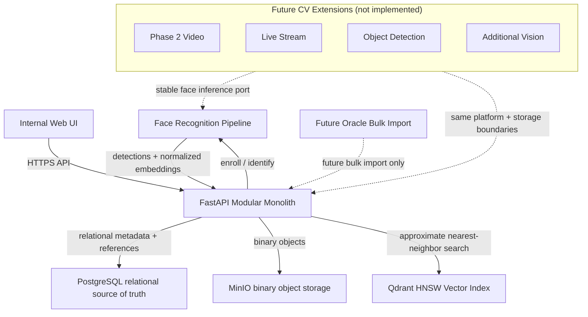

# MergenVision Phase 1 — High-Level Architecture

## Amaç

Bu diyagram, Phase 1 kapsamında fotoğraf bazlı yüz tanıma, kişi/fotoğraf enrollment ve tanıma geçmişi izlenebilirliğini gösterir. Amaç, teknik detaya boğulmadan sistemin ana parçalarını, veri sahipliğini ve gelecekteki genişleme sınırlarını anlatmaktır.

## High-Level Architecture

## Sistem nasıl çalışır?

1. **Giriş:** İç kullanıcılar `Internal Web UI` üzerinden sisteme girer. UI yalnızca FastAPI ile konuşur.
2. **Enrollment:** Fotoğraf gönderildiğinde FastAPI, yüzü doğrular, binary’i MinIO’ya yazar, metadata’yı PostgreSQL’e kaydeder ve embedding’i Qdrant HNSW index’ine ekler.
3. **Identification:** Gönderilen görseldeki yüzler algılanır, normalleştirilir, ArcFace embedding üretilir; Qdrant’ta HNSW arama yapılarak en yakın sample bulunur.
4. **Karar:** Benzerlik skoru eşiğine göre `known` veya `unknown` sonuç üretilir; işlem PostgreSQL’de `recognition process` olarak izlenir.
5. **Tüm yüzler:** Görseldeki tüm yüzler bağımsız işlenir; yüz yoksa bu normal bir iş sonucudur.
6. **Gelecek:** Oracle yalnızca toplu import kaynağıdır; Phase 2 video akışı, Phase 1 kabul testlerinden sonra ayrı tasarlanacaktır.

## Veri sahipliği

| Sınır | Sahip olduğu | Sahip olmadığı |
|---|---|---|
| PostgreSQL | Person, metadata, process/result, MinIO referansları, Qdrant referansları, national ID | binary fotoğraf, raw embedding |
| MinIO | Orijinal kişi fotoğrafları, retention kararı varsa recognition inputları | national ID, plaintext metadata |
| Qdrant | 512-D L2-normalize ArcFace embedding, HNSW search graph, minimal payload | first name, last name, national ID, binary fotoğraf |

Qdrant, PostgreSQL + MinIO + model pipeline ile yeniden oluşturulabilir **derived** bir search index’tir.

## Requirement karşılığı

- **REQ-001 — Oracle:** Online recognition hot path’inde yoktur; gelecekte bulk import boundary olarak gösterilmiştir.
- **REQ-002 — Büyük ölçek:** Sınırlar PostgreSQL/MinIO/Qdrant ayrımıyla kurulmuştur; 10M hedefi capacity-planning aşamasında detaylandırılacaktır.
- **REQ-003 — Fotoğraf bazlı tanıma:** Phase 1 ana kapsamıdır; Face Recognition Pipeline ve Qdrant HNSW search üzerinden çalışır.
- **REQ-004 — Kişi bilgileri:** National ID yalnızca PostgreSQL privacy boundary içinde tutulur, UI’da maskelenir, log/MinIO/Qdrant’a sızmaz.
- **REQ-005 — Kişi-fotoğraf eşleştirme:** Recognition sonucu kişi, fotoğraf/sample, benzerlik skoru ve process ile PostgreSQL’de ilişkilendirilir.
- **REQ-006 — Gizlilik/veri güvenliği:** PII boundary, binary boundary, minimal vector payload ve internal UI/API sınırı gösterilmiştir.
- **REQ-007 — Ölçeklenebilirlik:** Modüler monolith + external stores; Kubernetes/microservice day-one karmaşası yoktur.

## Phase 1 dışında

- GStreamer/DeepStream/NVDEC/tracker/NVENC pipeline ayrıntıları.
- Distributed queue, sharding, microservice.
- Automatic `new_anonymous` kaydı veya cross-request anonim persistence.
- Video/live-stream tabloları, camera/RTSP entities, generic object-detection tabloları.
- Tracker implementation, generic event bus, plugin framework, model marketplace, capability registry.
- ERD, tablo kolonu, API contract, endpoint implementasyonu.
- Docker Compose / Dockerfile / model engine.

## Patron gözüyle kontrol

1. Sisteme nereden giriliyor? — `Internal Web UI` → `FastAPI`.
2. Kişi ve fotoğraf nasıl kaydediliyor? — Enrollment ile MinIO, PostgreSQL ve Qdrant’a birlikte yazılıyor.
3. Yüz tanıma hangi bileşende gerçekleşiyor? — `Face Recognition Pipeline` embedding üretir, `FastAPI` Qdrant üzerinden arar.
4. National ID nerede kalıyor? — Yalnızca PostgreSQL’de; diğer katmanlara çıkmıyor.
5. Oracle bugün nerede? — Gelecekteki toplu import sınırında; online tanımaya karışmıyor.
6. Gelecekteki CV capability’leri nereye bağlanacak? — Aynı platform sınırlarına (auth, storage, provenance, observability, config, GPU/PostgreSQL infra) ancak kendi domain contract’larıyla ayrı modüller olarak.

## Kısa mimari notlar

- **Face detector:** Diyagramda `Face Recognition Pipeline` içinde soyut `FaceDetector` olarak kalır. Current candidate: dynamic RetinaFace; final selection requires reference/parity evidence.
- **Qdrant HNSW contract:** 512-D L2-normalized ArcFace embeddings, cosine similarity, HNSW approximate nearest-neighbor search, minimal PII-free payload. HNSW parametreleri (`m`, `ef_construct`, `hnsw_ef`, `full_scan_threshold`, `indexing_threshold`, `on_disk`, `quantization`, `shard_number`, `replication_factor`) bu aşamada kesinleştirilmemiştir; toplam kişi/sample sayısı, RAM/NVMe kapasitesi, recall/latency benchmarklarıyla sonraki Qdrant design aşamasında belirlenecektir.
- **Future CV extensibility:** Phase 1, ilk çalışan capability olan image-based face recognition’ı uygular. Gelecekteki video, live-stream ve object-detection capability’leri aynı platform sınırlarını kullanabilir ancak kendi domain ve inference contract’larıyla ayrı şekilde eklenecektir. Person/FaceSample yalnızca face-recognition domain’ine aittir; object detection veya generic track ID bu domain’e karıştırılmaz.
- **Legacy davranış desteği:** no-face normal sonuç, multi-face identification, original-image bounding box, image validation, corrupt/empty/unsupported input hataları, unique process ID, process traceability/history, multiple photos/samples per person, structured errors ve `known / unknown` sonuç desteklenir. Automatic anonymous persistence eklenmemiştir.
