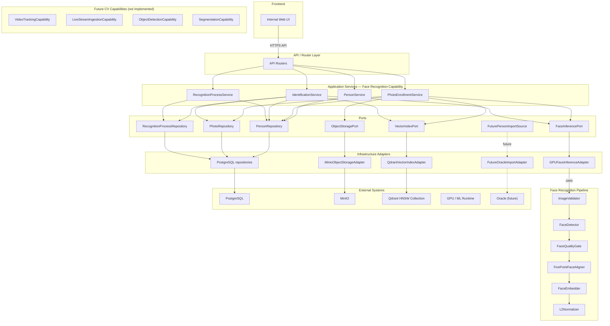

# MergenVision Phase 1 — Component Diagram

## Amaç

Bu diyagram, FastAPI uygulamasının katmanlarını, port/adapter ilişkilerini ve yüz tanıma akışının içindeki adımları gösterir. Amaç, implementasyon detayı vermeden servis sorumluluklarını ve veri tutarlılığı sınırlarını netleştirmektir.

## Component Diagram

## Katman sorumlulukları

- **Internal Web UI:** İnsan kullanıcı arayüzü; yalnızca FastAPI ile konuşur.
- **API / Router Layer:** HTTP isteklerini uygulama servislerine yönlendirir; iş mantığı içermez.
- **Application Services:** Enrollment, identification, kişi yönetimi ve process/history sorumlulukları. Cross-store workflow’u koordine ederler.
- **Ports:** Uygulamanın dış dünyadan beklediği soyut kontratlar. Servisler portlara bağlıdır; doğrudan store/ML runtime’a değil.
- **Infrastructure Adapters:** Port kontratlarını PostgreSQL, MinIO, Qdrant, GPU runtime ve gelecekte Oracle için somutlar.
- **Face Recognition Pipeline:** Image validation, detection, quality, five-point alignment, ArcFace embedding, L2 normalization. `GPUFaceInferenceAdapter` içinde çalışır.
- **External Systems:** PostgreSQL (truth), MinIO (binary), Qdrant (HNSW ANN index), GPU/ML runtime, Oracle (future import).

## Storage ownership

| Store | Rol | Sahip olduğu | Sahip olmadığı |
|---|---|---|---|
| PostgreSQL | Relational source of truth | Person, person/photo/sample metadata, national ID, process/result, MinIO object references, Qdrant point references, lifecycle/status | binary fotoğraf, raw embedding |
| MinIO | Binary object owner | Orijinal kişi fotoğrafları, retention varsa recognition input’ları | national ID, açık metadata |
| Qdrant | Derived vector search index | 512-D L2-normalized ArcFace embeddings, HNSW search graph, minimal payload | first name, last name, national ID, details, binary fotoğraf |

**National ID** yalnızca PostgreSQL privacy boundary içindedir; UI’da maskelenir, log/MinIO/Qdrant/object key’lere yazılmaz.

## Enrollment akışı

1. `PhotoEnrollmentService` input’u alır.
2. `FaceInferencePort` → `GPUFaceInferenceAdapter` → validation/detection/alignment/embedding/L2-normalization.
3. `ObjectStoragePort` → `MinioObjectStorageAdapter` ile fotoğraf MinIO’ya yazılır.
4. PostgreSQL repositories ile person, photo/sample metadata ve store referansları kaydedilir.
5. `VectorIndexPort` → `QdrantVectorIndexAdapter` ile embedding HNSW index’e eklenir.
6. Durum finalize edilir.

## Identification akışı

1. `IdentificationService` input’u alır.
2. `FaceInferencePort` → detection + bounding boxes + normalized embeddings.
3. `VectorIndexPort` → `QdrantVectorIndexAdapter` ile her embedding için HNSW search.
4. `IdentificationService` similarity skorlarına göre `known / unknown` kararı verir.
5. `RecognitionProcessRepository` ile process ve result ilişkisel olarak saklanır.
6. Sonuç UI’a döner.

ML runtime doğrudan Qdrant client kullanmaz; embedding üretimi ile vector search orchestration ayrı servis sınırlarındadır.

## Cross-store consistency notu

Enrollment, PostgreSQL, MinIO ve Qdrant arasında çok adımlı bir workflow’tur. Bir adım başarısız olursa yarım aktif person/sample bırakılmamalıdır:

- Qdrant relational source of truth olarak kullanılmaz.
- Retry/compensation `Application Services` sınırında yönetilir.
- Binary, metadata ve embedding yazımında başarısızlık durumunda önceki adımların geri alınması planlanır; bu görevde transaction/saga ayrıntısı tasarlanmamıştır.

## Phase 2 and future CV boundaries

> Phase 2, Phase 1 acceptance tamamlandıktan sonra GPU-first GStreamer/DeepStream mimarisi olarak ayrıca tasarlanacaktır.

Phase 1, ilk çalışan capability olan image-based face recognition’ı uygular. Gelecekteki video, live-stream ve object-detection capability’leri aynı platform sınırlarını kullanabilir ancak kendi domain ve inference contract’larıyla ayrı şekilde eklenecektir.

## Future CV capability boundaries

Paylaşılabilecek platform sınırları:

- authentication/privacy boundary
- media/object storage (MinIO)
- process/job traceability (PostgreSQL)
- model and runtime provenance
- health/observability
- configuration
- PostgreSQL infrastructure
- GPU runtime infrastructure
- future input-source adapters

Ayrı kalması gereken domain sınırları:

- Person ve FaceSample yalnızca face-recognition domain’ine aittir.
- Object detections, Person/FaceSample olarak saklanmaz.
- Track ID, person ID değildir.
- Generic object ID, person ID değildir.
- Face Qdrant collection yalnızca face identity embedding’lerine aittir.
- Gelecekte object embedding/re-identification gerekiyorsa ayrı collection ve contract kullanılır.
- Qdrant bütün CV sonuçlarının ana veritabanı değildir.
- PostgreSQL her domain’in ilişkisel source of truth’u olmaya devam eder.
- MinIO media/binary object owner olmaya devam eder.

Korunan face-recognition contract:

- image/frame or aligned input → face detection → quality validation → five-point alignment → ArcFace embedding → identity matching

## Patron gözüyle kontrol

1. UI doğrudan veritabanıyla konuşuyor mu? — Hayır, yalnızca FastAPI üzerinden.
2. Kim enrollment’u yönetiyor? — `PhotoEnrollmentService`.
3. Vector search nerede? — `VectorIndexPort` → `QdrantVectorIndexAdapter` → Qdrant HNSW.
4. ML runtime Qdrant’a bağlı mı? — Hayır; embedding üretimi ve arama ayrılmıştır.
5. Bir store başarısız olursa ne olur? — `Application Services` workflow’u yönetir; Qdrant truth değildir.
6. Phase 2 şimdi mi geliyor? — Hayır; Phase 1 kabul sonrası ayrı tasarlanacak.

## Kısa mimari notlar

- **Face recognition capability boundary:** `FaceRecognitionCapability` (Application Services) → `FaceInferencePort` → `GPUFaceInferenceAdapter`. Gelecekte `ObjectDetectionCapability`, `VideoTrackingCapability`, `LiveStreamIngestionCapability`, `SegmentationCapability` gibi capability’ler ayrı modüller olarak eklenebilir; bunlar shared platform sınırlarını kullanır ancak face-specific model ve domain’e karışmaz.
- **Qdrant HNSW contract:** 512-D L2-normalized ArcFace embeddings, cosine similarity, HNSW approximate nearest-neighbor search, minimal PII-free payload (`personId`, `sampleId`, `modelVersion`, `active`). HNSW parametreleri (`m`, `ef_construct`, `hnsw_ef`, `full_scan_threshold`, `indexing_threshold`, `on_disk`, `quantization`, `shard_number`, `replication_factor`) bu görevde kesinleştirilmemiştir; gerçek ölçek, RAM/NVMe, recall ve latency verileriyle sonraki Qdrant design aşamasında belirlenecektir.
- **Legacy davranış desteği:** no-face normal sonuç, multi-face identification, original-image bounding box, image validation, corrupt/empty/unsupported input hataları, unique process ID, process traceability/history, multiple photos/samples per person, structured errors ve `known / unknown` sonuç. Automatic anonymous persistence eklenmemiştir.
