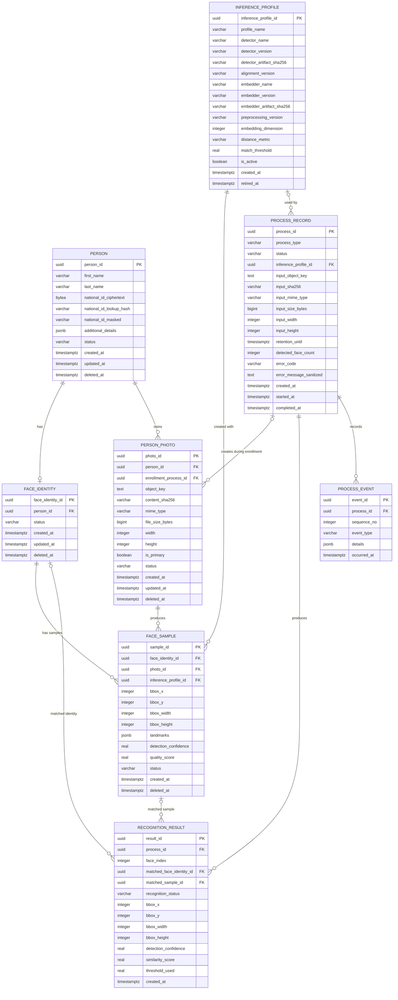

# MergenVision Phase 1 — PostgreSQL ERD

## Scope ve source-of-truth

Bu doküman Phase 1 PostgreSQL ilişkisel şemasını anlatır. Şema kullanıcı ve kıdemli mimari reviewer tarafından kesin olarak belirlenmiştir; bu görevde tablo, kolon veya ilişki eklenmemiştir/çıkarılmamıştır.

Source-of-truth sıralaması:

1. Bu dokümandaki kesin Phase 1 kararları
2. Senior/client REQ-001–REQ-007
3. Onaylanmış mimari dokümanlar (`01-phase1-high-level-architecture.md`, `02-phase1-component-diagram.md`)
4. `whatwentwrong.md` dersleri
5. `opensourcereferences/references.md`

REVIEW_NOTE: Teknik itiraz yoktur; şema verildiği haliyle aktarılmıştır.

## Database design decisions

- Bütün primary key'ler `uuid`dır ve değerleri UUIDv7 üretir.
- Bütün zaman alanları `timestamptz` (UTC) olarak tutulur.
- Raw national ID PostgreSQL'de saklanmaz; encrypted ciphertext + HMAC lookup hash + masked display tutulur.
- Yüz embedding’leri PostgreSQL'e konmaz; Qdrant HNSW koleksiyonunda saklanır. `face_sample.sample_id` aynı zamanda Qdrant point ID'dir.
- Fotoğraf binary’leri PostgreSQL'e konmaz; MinIO'da saklanır. PostgreSQL yalnızca PII içermeyen `object_key` ve metadata tutar.
- Person/photo/identity/sample lifecycle soft-delete veya deactivation ile yönetilir.
- History tabloları (`process_record`, `recognition_result`, `process_event`) broad cascade ile kaybedilmez.
- Phase 1 identity sonucu yalnızca `known` veya `unknown`dur; automatic anonymous persistence yoktur.

## Entity Relationship Diagram

## Patron gözüyle tablo açıklamaları

- **person:** Kişinin temel kaydı. Ad, soyad, national ID'nin şifreli/hash'li/maskeli halleri ve diğer detaylar burada. Tek yerde PII tutulur.
- **face_identity:** Bir kişinin yüz kimliği. Kişi enrollment yapmadan önce olmayabilir; Phase 1'de bir kişi en fazla bir aktif face identity taşır.
- **person_photo:** Kişiye ait fotoğrafların metadata’sı. Fotoğraf binary’si MinIO'da; burada sadece object key ve teknik metadata (sha256, çözünürlük vb.) vardır.
- **face_sample:** Bir fotoğraftan çıkarılmış ve inference profille üretilmiş geçerli yüz örneği. Bounding box, landmark ve güven skoru burada. Embedding Qdrant'ta, `sample_id` aynı zamanda Qdrant point ID'dir.
- **inference_profile:** Model/runtime provenance kaydı. Detector/embedder versiyonları, artifact hash’leri, preprocessing versiyonu, eşik değeri gibi immutable config tutar. Eski kayıtlar silinmez.
- **process_record:** Her işlemin izini tutar. Enrollment, identify, person create/update/delete gibi işlemler benzersiz process ID ile kaydedilir.
- **recognition_result:** Bir identification process’inde tespit edilen her yüzün sonucu. `known` ise eşleşen identity/sample’a referans verir; `unknown` ise bu referanslar null’dur.
- **process_event:** Process’in adım adım geçmişi. Append-only event’ler; PII ve secret içermez.

## Identity ve person-photo matching açıklaması

Bir recognition sonucu şu zincirle kişi ve fotoğrafa bağlanır:

- `recognition_result` → `matched_face_identity_id` → `face_identity` → `person`
- `recognition_result` → `matched_sample_id` → `face_sample` → `person_photo`

Bir kişinin birden fazla fotoğrafı ve her fotoğraftan farklı inference profile’larla birden fazla sample’ı olabilir. Bu yapı REQ-005 kişi-fotoğraf eşleştirmesini sağlar.

Görselde yüz yoksa `process_record.detected_face_count = 0` olur ve `recognition_result` row’u üretilmez; bu normal bir iş sonucudur.

## National ID / privacy açıklaması

- **raw national ID** PostgreSQL'de saklanmaz.
- `national_id_ciphertext` authenticated encryption ciphertext’tir; şifreleme anahtarı veritabanı dışındadır.
- `national_id_lookup_hash` düz SHA değil; secret-keyed HMAC tabanlı lookup değeridir.
- `national_id_masked` UI ve listelerde gösterilecek maskelenmiş değerdir.
- National ID first name, last name ve diğer PII; Qdrant payload’a, MinIO object key’lere, log/event’lere ve `recognition_result` gibi downstream tablolara taşınmaz.

## MinIO / Qdrant ownership açıklaması

- **MinIO:** Orijinal fotoğraf binary’lerinin sahibidir. `person_photo.object_key` PII içermez; örnek: `people/{personId}/photos/{photoId}/source`.
- **PostgreSQL:** relational source of truth’tur; object key’ler ve Qdrant point referansları burada tutulur.
- **Qdrant:** Derived vector search index’tir. Her `face_sample.sample_id` bir Qdrant point ID'dir. Qdrant payload’ı minimal ve PII-free kalır: `faceIdentityId`, `sampleId`, `personId`, `inferenceProfileId`, `active`.
- Database ile MinIO veya Qdrant arasında foreign key yoktur; consistency application service tarafından yönetilir.

## Constraint ve integrity kuralları

- Bütün primary key’ler UUIDv7 üretilir.
- `PERSON.national_id_lookup_hash` UNIQUE’tır; soft-delete sonrası da uniqueness korunur.
- `FACE_IDENTITY.person_id` UNIQUE’tır (Phase 1'de bir kişi en fazla bir aktif face identity).
- `PERSON_PHOTO.object_key` UNIQUE; aynı kişiye aynı içerik (`PERSON_PHOTO.person_id`, `content_sha256`) UNIQUE.
- Her kişi için en fazla bir aktif primary photo partial unique index ile sağlanır.
- `FACE_SAMPLE.photo_id` + `inference_profile_id` UNIQUE.
- `RECOGNITION_RESULT.process_id` + `face_index` UNIQUE.
- `PROCESS_EVENT.process_id` + `sequence_no` UNIQUE.
- Bbox width/height ve file size pozitif; detection confidence 0..1; quality_score null veya 0..1.
- `RECOGNITION_RESULT.recognition_status` `known` ise `matched_face_identity_id`, `matched_sample_id` ve `similarity_score` dolu olmalıdır; `unknown` ise identity/sample referansları null’dur.
- Soft-delete/deactivation ile history kayıpları önlenir; process/result/event tablolarına broad cascade uygulanmaz.

## Index ve scale notları

- PERSON: UNIQUE `national_id_lookup_hash`; index `status`; name search gerektiğinde ayrıca indexlenecek.
- FACE_IDENTITY: UNIQUE `person_id`; index `status`.
- PERSON_PHOTO: index `(person_id, status)`; UNIQUE `object_key`; UNIQUE `(person_id, content_sha256)`; partial unique active primary photo.
- FACE_SAMPLE: index `(face_identity_id, status)`; index `(inference_profile_id, status)`; UNIQUE `(photo_id, inference_profile_id)`. `sample_id` Qdrant point ID olarak kullanılır.
- PROCESS_RECORD: index `(process_type, status, created_at)`; index `created_at`. Hacim ölçüldükten sonra zaman bazlı partitioning değerlendirilebilir; Phase 1'de zorunlu değildir.
- RECOGNITION_RESULT: UNIQUE `(process_id, face_index)`; index `(matched_face_identity_id, created_at)`; index `matched_sample_id`; index `(recognition_status, created_at)`.
- PROCESS_EVENT: UNIQUE `(process_id, sequence_no)`; index `occurred_at`.
- INFERENCE_PROFILE: UNIQUE `profile_name`; aynı anda tek active profile kuralı daha sonra partial unique index ile uygulanabilir.

10M hedefi için temel sınırlar:

- Embedding PostgreSQL’e konulmaz.
- Büyük binary PostgreSQL’e konulmaz.
- Vector araması Qdrant HNSW üzerinden yapılır.
- PII Qdrant’a kopyalanmaz.
- Unbounded JSON result blob kullanılmaz.
- `additional_details` JSONB yalnızca gerekli alanlar için kullanılır; otomatik GIN index eklenmez.
- Gerçek query/volume ölçülmeden sharding/partitioning/microservice eklenmez.

## Requirement traceability

- **REQ-001 — Oracle:** Phase 1 ERD Oracle import tablosu oluşturmaz. Oracle `FuturePersonImportSource` boundary üzerinden gelecekte entegre olacaktır; online recognition dependency değildir.
- **REQ-002 — 10M ölçek:** UUIDv7, normalized relational references, binary/vector ayrımı, targeted indexler, ileride ölçümlü partitioning sağlanır.
- **REQ-003 — Fotoğraf bazlı yüz tanıma:** `person_photo`, `face_identity`, `face_sample`, `inference_profile`, `recognition_result` tabloları kapsar.
- **REQ-004 — Kişi bilgileri:** `person` tablosu ad, soyad, national ID (encrypted/HMAC/masked) ve `additional_details` ile desteklenir.
- **REQ-005 — Kişi-fotoğraf eşleştirme:** `person` → `face_identity` → `face_sample` → `person_photo` zinciri ve `recognition_result` → matched identity/sample ilişkisi sağlar.
- **REQ-006 — Gizlilik/veri güvenliği:** Encrypted national ID, HMAC lookup, masked display, PII-free MinIO keys, PII-free Qdrant payload, sanitized process event/error mesajları.
- **REQ-007 — Ölçeklenebilirlik:** PostgreSQL relational truth, MinIO binary ownership, Qdrant HNSW derived index, selected indexler, premature dağıtık mimari yok.

Legacy davranışlar:

- Multi-face: `process_record` 1 → N `recognition_result`.
- No-face: completed process + zero result.
- Bounding box: `recognition_result` ve `face_sample` bbox kolonları.
- Multiple samples: `face_identity` 1 → N `face_sample`.
- Process ID / history: `process_record` + `process_event`.
- Face history: `recognition_result` index by `matched_face_identity_id`.
- Structured errors: `process_record.error_code` + sanitized message.
- Automatic anonymous persistence: Phase 1’e alınmamıştır.

## Phase 1 dışında bırakılan tablolar

Aşağıdaki tablolar Phase 1 kapsamı dışındadır ve ERD'ye eklenmemiştir:

- `video_asset`, `video_job`, `video_track`, `video_track_detection`, `track_appearance`, `track_identity_decision`, `video_artifact`
- Worker lease/retry tabloları
- RTSP/live-stream ve camera tabloları
- Object detection ve segmentation tabloları
- Oracle import job/checkpoint/error tabloları
- Anonymous cross-request persistence tabloları

## Phase 2 database review gate

Phase 2 implementasyonu başlamadan önce:

1. Senior Phase 2 requirements yeniden tamamen okunacak.
2. Phase 1 gerçek schema ve data volume incelenecek.
3. `Person` / `FaceIdentity` / `FaceSample` ilişkileri yeniden değerlendirilecek.
4. Additive Alembic migration ve backfill planı hazırlanacak.
5. Migration gerçek veri kopyası üzerinde test edilecek.
6. Sonra Phase 2 implementasyonu başlayacak.

## Patron kontrol soruları

1. Kaç tablo var? — Sekiz.
2. National ID nerede ve nasıl saklanıyor? — Sadece `person` tablosunda; ciphertext + HMAC hash + masked; raw yok.
3. Fotoğraf binary’si veritabanında mı? — Hayır, MinIO'da; PostgreSQL’de object key var.
4. Embedding PostgreSQL’de mi? — Hayır, Qdrant’ta; `face_sample.sample_id` Qdrant point ID.
5. Yüz yoksa sonuç nasıl kaydedilir? — `recognition_result` row’u olmaz, `process_record.detected_face_count = 0` olur.
6. Phase 2 için tablo eklendi mi? — Hayır; video/live-stream/object-detection tabloları Phase 2 review gate’den sonra tasarlanacak.
