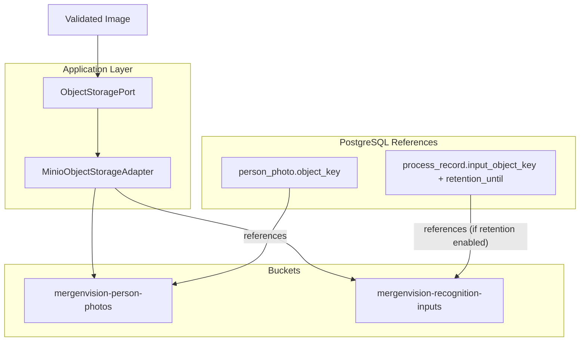

# MergenVision Phase 1 — MinIO Object Layout ve Retention Tasarımı

Bu doküman Phase 1'de MinIO'nun sorumluluk sınırlarını, bucket/object-key tasarımını, validation sınırlarını, metadata ve retention kurallarını anlatır. Tasarım MinIO/S3 resmi davranışları ile tutarlıdır; implementation kodu üretilmemiştir.

## A. MinIO'nun sorumluluğu

MinIO yalnızca binary object'lerin sahibidir:

- Kalıcı enrollment/person fotoğrafları
- Retention açıkça etkinleştirilmişse geçici identification input görüntüleri
- İleride açıkça gerekli görülürse kontrollü import artefact'ları

MinIO şunların sahibi değildir:

- Person relational metadata
- National ID
- Face identity lifecycle
- Recognition result ve process state
- Embedding ve Qdrant index state

Bunlar PostgreSQL veya Qdrant'ın sorumluluğundadır.

## B. Bucket tasarımı

Phase 1'de iki ayrı bucket tanımlanır:

1. Kalıcı enrollment fotoğrafları: `mergenvision-person-photos`
2. Opsiyonel/geçici identification input'ları: `mergenvision-recognition-inputs`

Bucket isimleri environment variable ile değiştirilebilir:

- `MINIO_PERSON_PHOTOS_BUCKET`
- `MINIO_RECOGNITION_INPUTS_BUCKET`

Kod içinde bucket adı hard-code edilmeyecektir.

Recognition input retention varsayılan olarak kapalıdır:

- `RECOGNITION_INPUT_RETENTION_HOURS=0`
- Değer `0` ise identification input görüntüsü MinIO'ya kalıcı olarak yazılmaz.
- Değer `0` üzerinde ise object geçici bucket'a yazılır ve lifecycle/uygulama cleanup politikası ile silinir.

## C. Object key tasarımı

Kalıcı person photo key formatı:

```text
people/{personId}/photos/{photoId}/source.{extension}
```

Örnek:

```text
people/0192a3f4-.../photos/0192b5c6-.../source.jpg
```

Geçici recognition input key formatı:

```text
processes/{yyyy}/{mm}/{dd}/{processId}/input.{extension}
```

Örnek:

```text
processes/2026/07/12/0192d8e9-.../input.jpg
```

Object key içinde ASLA bulunmayacak veriler:

- National ID
- Ad, soyad
- Kullanıcı tarafından gönderilen orijinal dosya adı
- E-posta, telefon, kurumsal sicil numarası veya başka PII

Object key yalnızca sistem UUID'leri ve teknik path parçaları içerir. Client tarafından gönderilen dosya adı güvenilir kabul edilmez ve key üretiminde kullanılmaz.

MinIO/S3 object isimleri en fazla 1024 karakter ve her `/` ile ayrılmış segment en fazla 255 karakter olabilir; yukarıdaki UUID tabanlı format bu sınırların çok altındadır.

## D. Desteklenen input ve validation sınırı

Başlangıçta desteklenen formatlar:

- JPEG: `image/jpeg`
- PNG: `image/png`

Zorunlu validation:

- MIME header tek başına yeterli değildir.
- Magic-byte/content sniffing yapılır.
- Decode edilebilirlik kontrol edilir.
- Boş input reddedilir.
- Boyut ve pixel-count limiti uygulanır.
- Extension server tarafından doğrulanmış MIME'dan üretilir.
- Orijinal kullanıcı filename'i object key'e girmez.

Başlangıç varsayılan limitleri:

- `MAX_IMAGE_SIZE_BYTES=15728640` (15 MiB)
- `MAX_IMAGE_PIXELS=40000000` (40 megapixel)

Bu değerler environment variable ile değiştirilebilir.

Bulk GPU enrollment'ın optimize edilmiş ana formatı JPEG’tir. Production bulk JPEG hot path hedefi:

compressed JPEG → GPU decode (nvjpegdec) → NVMM/CUDA device memory → GPU preprocess → TensorRT detector → GPU postprocess/quality → CUDA five-point alignment → TensorRT ArcFace → GPU L2 normalization → compact embedding/metadata transfer

PNG desteği ayrı ve açıkça tanımlanmış decoder adapter yoludur. PNG geldiğinde sessiz/tesadüfi fallback yapılmaz. Runtime implementation bu dokümanda yapılmayacaktır; yalnızca format contract ve boundary yazılmıştır.

## E. Object metadata

MinIO object metadata minimal ve PII-free olmalıdır.

İzin verilen teknik metadata örnekleri:

- Content SHA-256
- Person ID
- Photo ID
- Process ID
- Verified MIME type
- Upload timestamp
- Schema/version marker

Metadata içinde bulunmayacaklar:

- National ID
- Ad, soyad
- `additional_details`
- Recognition sonucu
- Secret/token
- Raw request header

PostgreSQL canonical metadata sahibidir. MinIO metadata yalnızca operasyonel yardımcı bilgidir; relational truth değildir.

## F. Retention ve delete davranışı

**Person photo**

- Kalıcı enrollment artefact'ıdır.
- Person/photo deactivation ile hemen fiziksel olarak kaybolmak zorunda değildir.
- Explicit privacy erasure veya onaylanmış retention politikası fiziksel silmeyi tetikler.
- PostgreSQL history kayıtları broad cascade ile silinmez.
- MinIO object silme ve PostgreSQL lifecycle değişimi application service tarafından koordine edilir.

**Recognition input**

- Varsayılan olarak saklanmaz.
- Retention etkinse geçici bucket'ta tutulur.
- `retention_until`, `process_record` ile ilişkilendirilir.
- Süre dolunca MinIO lifecycle veya kontrollü cleanup ile silinir.
- Process/result geçmişi kalabilir, fakat binary input silinebilir.

**Aligned face crop**

- Varsayılan olarak MinIO'ya yazılmaz.
- Debug amacıyla otomatik olarak saklanmaz.
- Gelecekte açık requirement ve privacy review olmadan eklenmez.

## G. Erişim ve güvenlik

- Bucket'lar public olmayacaktır.
- Frontend doğrudan kalıcı MinIO credential almayacaktır.
- Binary erişimi backend authorization boundary üzerinden sağlanır.
- Presigned URL gerekiyorsa kısa süreli ve purpose-limited olur.
- TLS deployment sırasında zorunlu production hedefidir.
- MinIO secret/access key repository'ye veya response'a yazılmaz.
- National ID ve PII object key/log'a girmez.
- Server-side encryption seçeneği deployment/security planında ele alınır; burada sahte “enabled” iddiası yapılmaz.

## H. Cross-store consistency

PostgreSQL, MinIO ve Qdrant tek distributed transaction paylaşmaz.

Enrollment service kontrollü state/compensation uygular:

1. Request ve image validation
2. Tam olarak bir geçerli enrollment yüzü doğrulama
3. Embedding üretimi
4. PostgreSQL process başlatma
5. MinIO object yazma
6. PostgreSQL `person_photo`/`face_sample` lifecycle kaydı
7. Qdrant point upsert
8. Kayıtları active/completed duruma getirme
9. Hata halinde idempotent compensation/retry

Qdrant derived/rebuildable'dır. MinIO binary owner'dır. PostgreSQL lifecycle ve ilişki truth sahibidir.

Bu bölüm implementation kodu vermez; yalnızca sahiplik ve failure davranışını açıklar.

## I. Diyagram



## J. Patron kontrol soruları

- **Fotoğrafın kendisi nerede?** — `mergenvision-person-photos` bucket'ında.
- **Fotoğraf metadata’sı nerede?** — PostgreSQL `person_photo` tablosunda; canonical truth burada.
- **Embedding nerede?** — Qdrant HNSW collection'da; PostgreSQL'de değil.
- **Object key PII içeriyor mu?** — Hayır; yalnızca UUID'ler ve teknik path'ler.
- **Identification input varsayılan olarak saklanıyor mu?** — Hayır; `RECOGNITION_INPUT_RETENTION_HOURS=0` varsayılır.
- **Aligned crop saklanıyor mu?** — Hayır; açık requirement yok.
- **MinIO arızalanırsa kim compensation yönetiyor?** — Application service; PostgreSQL truth korunur ve retry/rebuild mümkündür.
- **Phase 2 artefact’ı eklendi mi?** — Hayır.

## Referans notu

MinIO object naming, metadata, lifecycle expiration ve presigned URL davranışı MinIO resmi dokümantasyonuyla çapraz kontrol edilmiştir. Qdrant ve FastAPI davranışları ayrı ilgili dokümanlarda ele alınmıştır.
