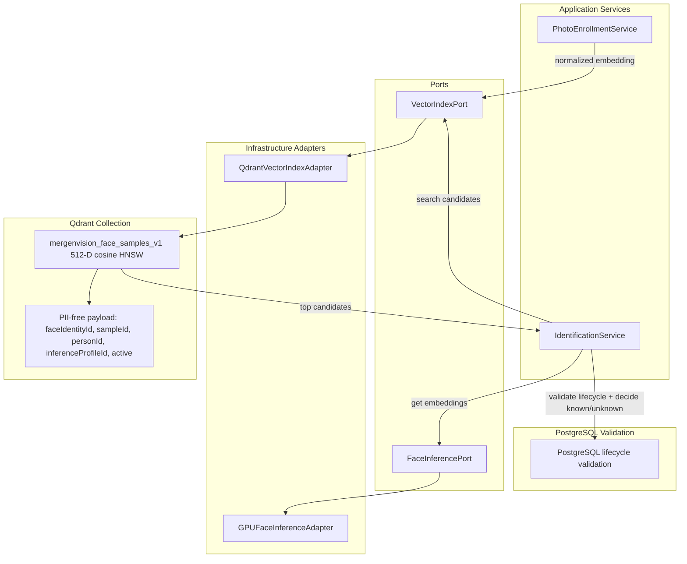

# MergenVision Phase 1 — Qdrant Vector Collection ve HNSW Tasarımı

Bu doküman Phase 1'de Qdrant'ın rolünü, vector collection contract'ını, HNSW baseline'ını, search ve upsert davranışını anlatır. Tasarım Qdrant resmi dokümantasyonuyla çapraz kontrol edilmiştir; implementation kodu üretilmemiştir.

## A. Qdrant'ın rolü

Qdrant:

- ArcFace embedding search yapar.
- Derived ve rebuild edilebilir index'tir.
- Person relational truth değildir.
- Fotoğraf binary sahibi değildir.
- PII database değildir.
- Recognition history sahibi değildir.

PostgreSQL olmadan Qdrant payload tek başına client'a person bilgisi dönmek için kullanılmaz.

## B. Collection

Başlangıç collection adı:

```text
mergenvision_face_samples_v1
```

Environment variable:

```text
QDRANT_FACE_COLLECTION=mergenvision_face_samples_v1
```

Collection vector contract:

- Dimension: 512
- Distance: Cosine
- Vector name: default unnamed vector
- Input embedding: ArcFace output
- Embedding GPU üzerinde L2 normalize edilir
- PostgreSQL `face_sample.sample_id` = Qdrant point ID
- Point ID UUID string olarak taşınır
- Collection/model contract `inference_profile` ile eşleştirilir

Vector name `default unnamed vector` seçiminin gerekçeleri:

- Phase 1 collection yalnızca tek tür 512-D ArcFace embedding taşır.
- Named vector kullanılmasına ihtiyaç yoktur.
- Gelecekte object detection, multimodal veya başka embedding domain'leri face collection içine eklenmez.
- Farklı vector semantiği ayrı versioned collection/domain kullanır.

Farklı embedding boyutu veya semantiği olan model aynı collection'a sessizce yazılamaz.

Embedding model contract değişirse yeni inference profile, gerektiğinde yeni versioned collection ve kontrollü re-embedding/reindex planı gerekir.

## C. Point payload

Payload yalnızca şu alanları içerir:

- `faceIdentityId`
- `sampleId`
- `personId`
- `inferenceProfileId`
- `active`

PII kesinlikle bulunmaz:

- nationalId
- nationalIdMasked
- firstName / lastName
- additionalDetails
- MinIO object key
- original filename
- process error/message

`sampleId` point ID ile aynı olsa bile audit/debug contract nedeniyle payload'da tutulabilir.

## D. Payload index contract'ı

Phase 1'de oluşturulacak payload indexleri:

- `faceIdentityId`: keyword
- `personId`: keyword
- `inferenceProfileId`: keyword
- `active`: bool

`sampleId` için ayrıca payload index oluşturulmaz; Qdrant point ID olarak kullanılır.

Kesin Qdrant schema syntax kullanılan Qdrant sürümünün resmi dokümanıyla implementation aşamasında doğrulanacaktır. Payload indexlerin veri yüklenmeden önce oluşturulması, filter-aware HNSW graph oluşumu için avantaj sağlar.

## E. HNSW başlangıç baseline

Başlangıç baseline:

- `m` = 16
- `ef_construct` = 128
- `full_scan_threshold` = 10000
- query `hnsw_ef` = 128
- `exact` = false

Bunlar kutsal sabit değildir. Aşağıdakiler ölçülmeden değiştirilmez:

- Gerçek dataset
- Same-person/different-person accuracy
- Recall@K
- p50/p95/p99 latency
- RAM/NVMe kullanımı
- Ingestion süresi

10M hedefi “başlangıçta rastgele büyük HNSW değerleri ver” anlamına gelmez.

HNSW ile recognition threshold farklı şeylerdir:

- HNSW `hnsw_ef`: aday bulma doğruluğu/latency ayarı
- `match_threshold`: kişinin known/unknown karar eşiği

Bunlar birbirine karıştırılmaz.

## F. Search davranışı

Identification search akışı:

1. Valid face embedding üretilir.
2. Embedding L2 normalize edilir.
3. Qdrant sorgusu şu filtrelerle yapılır:
   - `active = true`
   - `inferenceProfileId` = aktif/uyumlu profile
4. Top candidate sample'lar alınır.
5. Application service sample sonuçlarını person bazında değerlendirir.
6. En iyi skor calibrated `match_threshold` ile karşılaştırılır.
7. Threshold üzerindeyse `known`.
8. Threshold altındaysa `unknown`.
9. Unknown point olarak Qdrant'a otomatik yazılmaz.

Başlangıç search candidate limiti:

```text
QDRANT_SEARCH_LIMIT=10
```

Bu değer benchmark/calibration ile değiştirilebilir.

Qdrant skoru tek başına client'a nihai person truth olarak dönmez. Application service Qdrant point ID/payload'ını PostgreSQL kayıtlarıyla doğrular.

Inactive/deleted person, identity veya sample known olarak döndürülemez.

## G. Multiple sample stratejisi

Phase 1'de:

- Her geçerli `face_sample` ayrı Qdrant point'idir.
- Kişinin birden fazla fotoğrafı olabilir.
- Kişinin birden fazla sample embedding'i olabilir.
- Search sample-level yapılır.
- Application service candidate'ları person/identity seviyesinde birleştirir.

Phase 1'de person centroid zorunlu değildir.

10M scale için ileride değerlendirilebilir:

- person centroid
- selected best samples
- scalar quantization
- product quantization
- on-disk vectors/index
- shard/replica planı

Bunların hiçbiri benchmark ve accuracy evidence olmadan Phase 1'de zorla açılmaz.

## H. Upsert, idempotency ve delete

- Point ID = sample ID olduğu için retry idempotent upsert yapabilir.
- Batch upsert kullanılabilir.
- Batch boyutu benchmark ile belirlenir.
- İlk benchmark adayları 256, 512 ve 1000 point batch'tir.
- Upsert başarılı olmadan sample active/completed kabul edilmez.
- Qdrant başarısızsa PostgreSQL truth korunur ve retry/rebuild mümkündür.
- Soft-delete/deactivation sırasında payload `active=false` yapılabilir veya point kontrollü silinebilir.
- Privacy erasure için fiziksel point delete desteklenir.
- Broad, filtersiz collection delete yasaktır.

## I. Bulk enrollment / index build

Bulk import başlangıç akışı:

```text
Oracle/import source → deterministic chunks → GPU workers → validated embeddings → bounded Qdrant batch upsert → checkpoint → verification
```

Bulk photo GPU hedefi:

```text
nvjpegdec → NVMM/CUDA → TensorRT detector → GPU postprocess → CUDA alignment → TensorRT ArcFace → GPU L2 → Qdrant batch upsert
```

Her GPU/process aynı preprocessing ve inference profile contract'ını kullanır.

Büyük bulk import sırasında HNSW indexing stratejisi Qdrant'ın kullanılan sürümüne ait resmi bulk upload guidance ile doğrulanacaktır. Bu dokümanda sürümden bağımsız kesin API komutu üretilmez.

Bulk acceptance evidence daha sonra şunları ölçmelidir:

- accepted/rejected photo sayısı
- no-face/multi-face/quality rejection
- embedding count
- duplicate/idempotent retry
- Qdrant point count
- random sample verification
- Recall@K
- latency
- index build süresi
- RAM/NVMe kullanımı

## J. Rebuild contract

Qdrant derived index olduğu için PostgreSQL + model artefact'larından rebuild edilebilir olmalıdır.

Rebuild source:

- active `face_sample`
- `face_identity`/`person` lifecycle
- `person_photo` object reference
- `inference_profile` provenance
- MinIO source image

Rebuild sırasında eski ve yeni collection arasında kontrollü version/switch yaklaşımı kullanılabilir. Bu görevde rebuild kodu yazılmaz.

## K. Diyagram



## L. Patron kontrol soruları

- **Embedding nerede saklanıyor?** — Qdrant `mergenvision_face_samples_v1` collection'ında.
- **Qdrant relational truth mü?** — Hayır; relational truth PostgreSQL'dedir.
- **Vector dimension kaç?** — 512.
- **Metric nedir?** — Cosine.
- **Point ID nedir?** — PostgreSQL `face_sample.sample_id`.
- **Payload PII içeriyor mu?** — Hayır; yalnızca ID'ler ve `active` flag.
- **Unknown otomatik kaydediliyor mu?** — Hayır.
- **HNSW ne işe yarıyor?** — Approximate nearest-neighbor arama; aday sample'ları hızlı bulur.
- **Recognition threshold ile hnsw_ef aynı şey mi?** — Hayır; `hnsw_ef` arama doğruluğu/latency ayarı, `match_threshold` known/unknown karar eşiğidir.
- **Qdrant kaybolursa rebuild mümkün mü?** — Evet; PostgreSQL + MinIO + inference profile provenance'ı ile yeniden oluşturulabilir.

## Referans notu

Qdrant HNSW configuration, cosine distance metric, payload indexes ve batch upsert davranışı Qdrant resmi dokümantasyonuyla çapraz kontrol edilmiştir.
