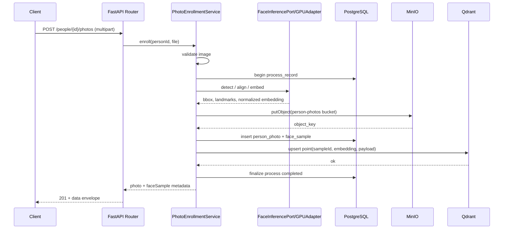
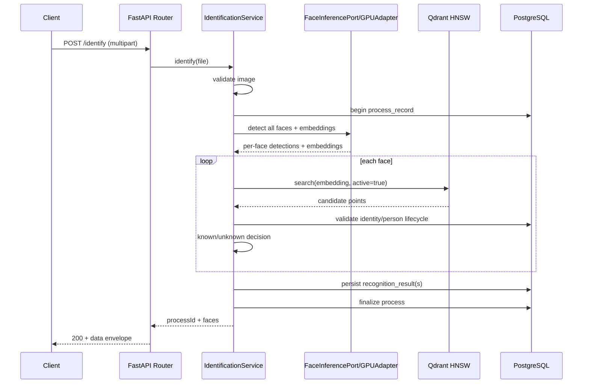

# MergenVision Phase 1 — REST API Contract

Bu doküman Phase 1 REST API contract'ını belirler. Kod, OpenAPI YAML, SQL veya implementation planı üretilmemiştir. FastAPI multipart/error davranışı resmi dokümantasyonla çapraz kontrol edilmiştir.

Base path:

```text
/api/v1
```

## A. API genel kuralları

- Request/response JSON alanları `camelCase`.
- ID'ler UUIDv7 string.
- Timestamp'ler ISO-8601 UTC.
- JSON endpoint'lerde `Content-Type: application/json`.
- Image upload endpoint'lerinde `multipart/form-data`.
- Person response'unda raw national ID dönmez; yalnız `nationalIdMasked` döner.
- Qdrant payload doğrudan API response olarak dönmez.
- Internal object key normal client response'a gereksiz yere açılmaz.
- Başarı ve hata cevapları tutarlı envelope kullanır.
- Pagination cursor-based'dir; default limit 50, maximum 200.
- DELETE fiziksel broad cascade yapmaz; lifecycle/deactivation uygular.
- Health/OpenAPI ve process read endpoint'leri dışında business mutation/inference çağrıları process kaydı oluşturur.
- Her HTTP isteğinde operasyonel `requestId` bulunur.
- Tracked business workflow'larda ayrıca `processId` bulunur.

Başarı envelope:

```json
{
  "data": {},
  "meta": {
    "requestId": "uuidv7",
    "processId": "uuidv7-or-null",
    "timestamp": "2026-07-12T12:00:00Z"
  }
}
```

Hata envelope:

```json
{
  "error": {
    "code": "STABLE_MACHINE_READABLE_CODE",
    "message": "Safe human-readable message",
    "details": {}
  },
  "meta": {
    "requestId": "uuidv7",
    "processId": "uuidv7-or-null",
    "timestamp": "2026-07-12T12:00:00Z"
  }
}
```

Error message/details içine PII, raw national ID, secret, filesystem path, stack trace veya model path yazılmaz.

## B. Status code prensipleri

- `200`: Successful read/update/identify result
- `201`: Person veya photo resource oluşturuldu
- `204`: Body gerektirmeyen lifecycle action (dokümanda tercihen 200 ile processId döner)
- `400`: Malformed request
- `404`: Resource bulunamadı
- `409`: Duplicate national ID, duplicate photo veya state conflict
- `413`: Image boyutu limiti aştı
- `415`: Desteklenmeyen/uyuşmayan MIME
- `422`: Semantik validation; enrollment no-face/multi-face/quality rejection
- `503`: PostgreSQL/MinIO/Qdrant/model readiness problemi
- `500`: Beklenmeyen sanitize edilmiş internal error

Identification görüntüsünde yüz bulunmaması HTTP error değildir:

- HTTP 200
- `detectedFaceCount = 0`
- `faces = []`

Enrollment fotoğrafında:

- 0 yüz → `422 ENROLLMENT_FACE_NOT_FOUND`
- 2+ geçerli yüz → `422 ENROLLMENT_MULTIPLE_FACES`
- quality gate başarısız → `422 ENROLLMENT_FACE_QUALITY_REJECTED`

## C. Health endpoint'leri

### GET /api/v1/health/live

Amaç: API process çalışıyor mu?

DB/MinIO/Qdrant/model probe yapmak zorunda değildir.

### GET /api/v1/health/ready

Kontrol:

- PostgreSQL
- MinIO
- Qdrant
- Face detector runtime
- Face embedder runtime
- Aktif inference profile

Response dependency durumlarını içerir fakat secret/path içermez. Health çağrıları process_record üretmez.

## D. People endpoint'leri

### POST /api/v1/people

JSON request:

```json
{
  "firstName": "Ada",
  "lastName": "Lovelace",
  "nationalId": "raw request value",
  "additionalDetails": {
    "department": "Research"
  }
}
```

Kurallar:

- `nationalId` transport sırasında TLS ile korunur.
- Loglanmaz.
- Response'a raw dönmez.
- PostgreSQL'de ciphertext + secret-keyed HMAC lookup + masked form tutulur.
- Aynı lookup hash duplicate ise `409 PERSON_NATIONAL_ID_CONFLICT`.
- Person fotoğrafsız oluşturulabilir.
- Face identity ilk başarılı enrollment fotoğrafı sırasında oluşturulabilir.
- Process record oluşturur.

201 response data:

```json
{
  "person": {
    "personId": "uuidv7",
    "firstName": "Ada",
    "lastName": "Lovelace",
    "nationalIdMasked": "*******1234",
    "additionalDetails": {
      "department": "Research"
    },
    "status": "active",
    "createdAt": "2026-07-12T12:00:00Z"
  }
}
```

### GET /api/v1/people

Query:

- `cursor` optional
- `limit` default 50, max 200
- `status` optional: active/inactive
- `search` optional; Phase 1'de güvenli ad/soyad araması
- national ID raw query param ile aranmaz

Response `data`:

```json
{
  "items": [
    {
      "personId": "uuidv7",
      "firstName": "Ada",
      "lastName": "Lovelace",
      "nationalIdMasked": "*******1234",
      "status": "active",
      "createdAt": "2026-07-12T12:00:00Z"
    }
  ],
  "nextCursor": "..."
}
```

### GET /api/v1/people/{personId}

Person detayını döner. Bulunamazsa `404 PERSON_NOT_FOUND`.

### PATCH /api/v1/people/{personId}

Kısmi update alanları:

- `firstName`
- `lastName`
- `nationalId`
- `additionalDetails`
- `status`

Raw nationalId response'a/log'a girmez. National ID değişirse ciphertext/HMAC/masked birlikte atomik güncellenir. Process record oluşturur.

### DELETE /api/v1/people/{personId}

Phase 1'de default davranış:

- Person inactive/deactivated yapılır.
- Face identity/sample aramada inactive olur.
- Qdrant point'leri `active=false` veya kontrollü delete ile arama dışına alınır.
- History korunur.
- MinIO binary'nin fiziksel silinmesi ayrı privacy erasure/retention politikasına bağlıdır.
- Broad cascade uygulanmaz.
- Process record oluşturur.

Response lifecycle sonucunu ve `processId`'yi içerir.

## E. Person photo endpoint'leri

### POST /api/v1/people/{personId}/photos

`multipart/form-data`:

- `file`: required
- `isPrimary`: optional boolean, default false

Kurallar:

- JPEG/PNG
- MIME + magic-byte + decode validation
- size/pixel limits
- Tam olarak bir geçerli enrollment yüzü
- Quality gate
- Five-point alignment
- ArcFace embedding
- MinIO durable upload
- PostgreSQL person_photo + face_sample
- Qdrant upsert
- İlk başarılı photo ise face_identity oluşturulabilir
- Duplicate content kontrolü `(personId, contentSha256)`
- Process record oluşturur

201 data örneği:

```json
{
  "photo": {
    "photoId": "uuidv7",
    "personId": "uuidv7",
    "mimeType": "image/jpeg",
    "fileSizeBytes": 123456,
    "width": 1920,
    "height": 1080,
    "contentSha256": "...",
    "isPrimary": true,
    "status": "active",
    "createdAt": "2026-07-12T12:00:00Z"
  },
  "faceSample": {
    "sampleId": "uuidv7",
    "faceIdentityId": "uuidv7",
    "inferenceProfileId": "uuidv7",
    "boundingBox": {
      "x": 100,
      "y": 80,
      "width": 400,
      "height": 400
    },
    "detectionConfidence": 0.99,
    "qualityScore": 0.92,
    "status": "active"
  }
}
```

Embedding response'a dönmez. MinIO internal object key normal response'a dönmez.

### GET /api/v1/people/{personId}/photos

Cursor pagination ile photo metadata listesi. Binary response değildir.

### GET /api/v1/people/{personId}/photos/{photoId}

Tek photo metadata'sı.

### PATCH /api/v1/people/{personId}/photos/{photoId}

Phase 1'de yalnız kontrollü lifecycle/primary update:

```json
{
  "isPrimary": true
}
```

Bir kişi için en fazla bir active primary photo. Process record oluşturur.

### DELETE /api/v1/people/{personId}/photos/{photoId}

- Photo/sample inactive/deleted lifecycle
- Qdrant sample search dışına alınır
- Son active sample silinirse identity aramada kullanılmaz
- History korunur
- Binary fiziksel silme privacy/retention politikasına bağlıdır
- Process record oluşturur

## F. Photo binary access

Internal UI'nin fotoğraf göstermesi gerekiyorsa:

### GET /api/v1/people/{personId}/photos/{photoId}/content

Davranış:

- Backend authorization boundary
- Başlangıç tercihi backend stream etme
- Permanent/public MinIO URL dönmez
- Cache/security header'ları privacy gereksinimine göre ayarlanır
- Gelecekte performans ölçümüyle kısa süreli presigned URL açılabilir

## G. Identification endpoint

### POST /api/v1/identify

`multipart/form-data`:

- `file`: required

Bu endpoint aynı görüntüdeki bütün geçerli yüzleri bağımsız işler.

Flow:

- Validate image
- Detect all faces
- Per-face geometry/quality gate
- Five-point alignment
- ArcFace embedding
- GPU L2 normalization
- Qdrant HNSW search
- PostgreSQL lifecycle/person validation
- known/unknown decision
- process/result persistence

200 response:

```json
{
  "processId": "uuidv7",
  "status": "completed",
  "detectedFaceCount": 2,
  "faces": [
    {
      "faceIndex": 0,
      "recognitionStatus": "known",
      "faceIdentityId": "uuidv7",
      "matchedSampleId": "uuidv7",
      "person": {
        "personId": "uuidv7",
        "firstName": "Ada",
        "lastName": "Lovelace",
        "nationalIdMasked": "*******1234",
        "additionalDetails": {
          "department": "Research"
        }
      },
      "boundingBox": {
        "x": 100,
        "y": 80,
        "width": 400,
        "height": 400
      },
      "detectionConfidence": 0.99,
      "similarityScore": 0.83,
      "thresholdUsed": 0.62
    },
    {
      "faceIndex": 1,
      "recognitionStatus": "unknown",
      "faceIdentityId": null,
      "matchedSampleId": null,
      "person": null,
      "boundingBox": {
        "x": 700,
        "y": 90,
        "width": 360,
        "height": 360
      },
      "detectionConfidence": 0.97,
      "similarityScore": 0.44,
      "thresholdUsed": 0.62
    }
  ]
}
```

Bu nesne ortak success envelope içinde `data` olarak yer alır.

Unknown için:

- Yeni person oluşturulmaz.
- Yeni face identity oluşturulmaz.
- Qdrant point oluşturulmaz.
- Automatic anonymous persistence yapılmaz.

No-face:

```json
{
  "processId": "uuidv7",
  "status": "completed",
  "detectedFaceCount": 0,
  "faces": []
}
```

HTTP 200'dür. Rejected detector candidates production response'ta geçerli yüz olarak gösterilmez.

## H. Process endpoint'leri

### GET /api/v1/processes

Internal UI/history için cursor pagination:

- `cursor`
- `limit`
- `processType` optional
- `status` optional
- `createdFrom` optional
- `createdTo` optional

PII veya raw input binary dönmez.

### GET /api/v1/processes/{processId}

Döndürülecekler:

- processId
- processType
- status
- inferenceProfileId
- detectedFaceCount
- safe errorCode
- sanitized errorMessage
- createdAt
- startedAt
- completedAt
- retentionUntil
- recognition results
- sanitized events gerektiğinde özet biçimde

### GET /api/v1/processes/{processId}/events

Cursor pagination ile sanitized append-only process events.

Bu read endpoint'leri yeni process_record üretmez; aksi halde recursive process history oluşur.

## I. Person history

### GET /api/v1/people/{personId}/history

Person'ın geçmiş recognition eşleşmelerini cursor pagination ile döner:

- processId
- occurredAt/createdAt
- faceIndex
- similarityScore
- thresholdUsed
- matchedSampleId
- inferenceProfileId

Input binary veya başka kişilerin PII'si dönmez.

## J. Error code catalog

| Kod | HTTP Status | Ne zaman döner? | Retryable | Client açıklaması |
|---|---|---|---|---|
| INVALID_REQUEST | 400 | Request body/param geçersiz | Hayır | Request formatı kontrol edin. |
| RESOURCE_NOT_FOUND | 404 | Kaynak bulunamadı | Hayır | İstenen kaynak mevcut değil. |
| INTERNAL_ERROR | 500 | Beklenmeyen sanitize hata | Opsiyonel | Sunucu hatası; destekle iletişime geçin. |
| DEPENDENCY_UNAVAILABLE | 503 | DB/MinIO/Qdrant/model down | Evet (exponential backoff) | Bir altyapı bağımlılığı geçici olarak kullanılamıyor. |
| PERSON_NOT_FOUND | 404 | `personId` yok | Hayır | Kişi bulunamadı. |
| PERSON_NATIONAL_ID_CONFLICT | 409 | Aynı national ID lookup hash | Hayır | Bu kimlik numarasıyla kayıtlı kişi zaten var. |
| PERSON_INACTIVE | 409 | İşlem inactive person üzerinde | Hayır | Kişi aktif değil. |
| IMAGE_EMPTY | 400 | Boş dosya | Hayır | Gönderilen görüntü boş. |
| IMAGE_TOO_LARGE | 413 | Dosya boyutu limit aştı | Hayır | Görüntü boyutu çok büyük. |
| IMAGE_PIXEL_LIMIT_EXCEEDED | 413 | Pixel sayısı limit aştı | Hayır | Görüntü çözünürlüğü çok yüksek. |
| IMAGE_UNSUPPORTED_MEDIA_TYPE | 415 | Desteklenmeyen MIME | Hayır | Desteklenmeyen görüntü formatı. |
| IMAGE_MIME_MISMATCH | 415 | Magic-byte MIME uyuşmazlığı | Hayır | MIME tipi içerikle uyuşmuyor. |
| IMAGE_DECODE_FAILED | 422 | Decode edilemez/bozuk | Hayır | Görüntü okunamıyor veya bozuk. |
| PHOTO_NOT_FOUND | 404 | `photoId` yok | Hayır | Fotoğraf bulunamadı. |
| PHOTO_DUPLICATE | 409 | `(personId, contentSha256)` aynı | Hayır | Aynı içerikli fotoğraf zaten kayıtlı. |
| ENROLLMENT_FACE_NOT_FOUND | 422 | 0 yüz | Hayır | Enrollment fotoğrafında yüz bulunamadı. |
| ENROLLMENT_MULTIPLE_FACES | 422 | 2+ geçerli yüz | Hayır | Enrollment fotoğrafında birden fazla yüz var. |
| ENROLLMENT_FACE_QUALITY_REJECTED | 422 | Quality gate başarısız | Hayır | Yüz kalitesi enrollment için yetersiz. |
| FACE_DETECTOR_UNAVAILABLE | 503 | Detector runtime hazır değil | Evet | Yüz detector servisi geçici olarak kullanılamıyor. |
| FACE_EMBEDDER_UNAVAILABLE | 503 | Embedder runtime hazır değil | Evet | Yüz embedder servisi geçici olarak kullanılamıyor. |
| VECTOR_INDEX_UNAVAILABLE | 503 | Qdrant erişilemez | Evet | Vector index geçici olarak kullanılamıyor. |
| PROCESS_NOT_FOUND | 404 | `processId` yok | Hayır | İşlem kaydı bulunamadı. |
| PROCESS_FAILED | 422 | Process failed durumunda tekrar işlem | Hayır | İşlem başarısız olmuş. |
| PROCESS_STATE_CONFLICT | 409 | State geçişi geçersiz | Hayır | İşlem durumu bu operasyonu desteklemiyor. |

Error message'lar PII, secret, path ve stack trace içermez.

## K. Duplicate ve retry güvenliği

Phase 1'de kalıcı request-level `Idempotency-Key` desteği yoktur çünkü ERD'ye idempotency key ve request fingerprint saklayacak alan veya tablo eklenmez; Redis veya in-memory idempotency çözümü de Phase 1 kapsamında önerilmez.

Bunun yerine duplicate ve retry güvenliği aşağıdaki mekanizmalarla sağlanır:

- POST /api/v1/people:
  `national_id_lookup_hash` unique constraint duplicate person oluşmasını engeller.

- POST /api/v1/people/{personId}/photos:
  `(person_id, content_sha256)` unique constraint aynı fotoğrafın tekrar enrollment edilmesini engeller.

- Qdrant:
  `face_sample.sample_id` point ID olarak kullanılır; aynı point ID ile tekrar upsert güvenlidir.

- PATCH:
  İstenen final state’e göre uygulanır; aynı güncellemenin tekrarı yeni tutarsızlık üretmemelidir.

- DELETE:
  Lifecycle/deactivation operasyonudur; zaten inactive/deleted kaynağa tekrar uygulanması güvenli ve tutarlı sonuç vermelidir.

- POST /api/v1/identify:
  Her tekrar bağımsız bir recognition operation sayılır ve yeni processId üretir.

- Cross-store retry:
  Application service PostgreSQL lifecycle state, deterministic IDs ve Qdrant idempotent upsert kullanır.
  MinIO object key sistem UUID’lerinden üretildiği için aynı workflow retry’ında aynı hedef key kullanılabilir.

Kalıcı request-level Idempotency-Key desteği gelecekte gerçekten gerekirse schema review ile ayrıca tasarlanacaktır.

## L. Versioning ve OpenAPI

- Base path `/api/v1`
- FastAPI generated OpenAPI gelecekte contract implementation'ının doğrulama kaynağı olacaktır.
- OpenAPI bu görevde üretilmeyecek.
- Breaking change yeni API version gerektirir.
- Response'tan alan çıkarmak veya anlam değiştirmek breaking change'tir.
- Optional additive alan mümkün olabilir.
- Model/inference profile detayları process/result provenance üzerinden izlenir.

## M. Phase 1 dışı endpoint'ler

Bu dokümana eklenmeyenler:

- Video upload/job endpoint'leri
- Track/frame/appearance endpoint'leri
- RTSP/live stream/camera endpoint'leri
- Object detection endpoint'leri
- Segmentation endpoint'leri
- Oracle import execution endpoint'leri
- Anonymous identity promotion endpoint'leri
- Worker lease/retry endpoint'leri

Bunlar ilgili requirement ve database review sonrasında ayrı phase contract'larında tasarlanacaktır.

## N. API akış diyagramları

### Enrollment sequence



### Identification sequence



## O. Patron kontrol soruları

- **Person fotoğrafsız oluşturulabilir mi?** — Evet.
- **Face identity ne zaman oluşur?** — İlk başarılı enrollment fotoğrafı sırasında.
- **Enrollment fotoğrafında kaç yüz kabul edilir?** — Tam olarak bir geçerli yüz.
- **Identify görüntüsünde birden fazla yüz destekleniyor mu?** — Evet; her yüz bağımsız sonuçlanır.
- **No-face HTTP error mü?** — Hayır; HTTP 200 ile `detectedFaceCount=0` döner.
- **Unknown otomatik kaydediliyor mu?** — Hayır; result olarak persist edilir ama anonymous identity/embedding oluşturulmaz.
- **Raw national ID response'ta var mı?** — Hayır; yalnızca masked döner.
- **ProcessId hangi işlemlerde oluşur?** — Health/OpenAPI dışında business mutation/inference çağrılarında.
- **Fotoğraf binary'sine UI nasıl erişir?** — `GET /people/{personId}/photos/{photoId}/content` üzerinden backend stream ile.
- **Phase 2 endpoint'i eklendi mi?** — Hayır.

## Referans notu

FastAPI file upload (`UploadFile`, `File`, `Form`, `python-multipart` requirement), response model validation ve `HTTPException` JSON response davranışı FastAPI resmi dokümantasyonuyla çapraz kontrol edilmiştir.
